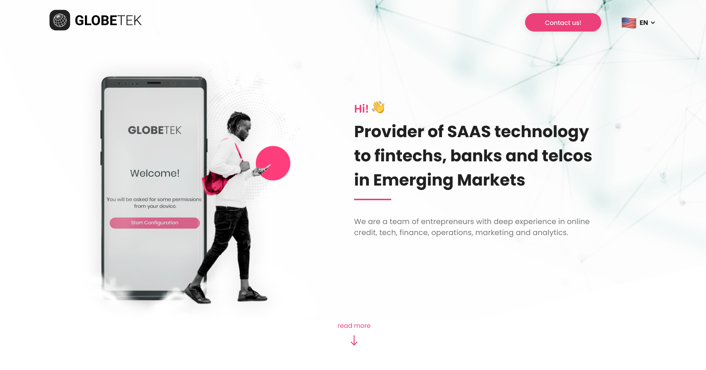

# Landing-page



## 🚀 Instalando Xbox-challenge

Para instalar o projeto, siga estas etapas:

- Crie uma pasta chamada Landing-page
- Faça um clone desse repositório na pasta criada

```
git clone https://github.com/LuizaAlanis/landing-page.git
```

## ☕ Visualizando a Landing Page

Para visualizar o projeto, siga estas etapas:

- Iniciando o servidor

```
npm run start

//ou

yarn run start
```

[⬆ Voltar ao topo](#Landing-page)<br>